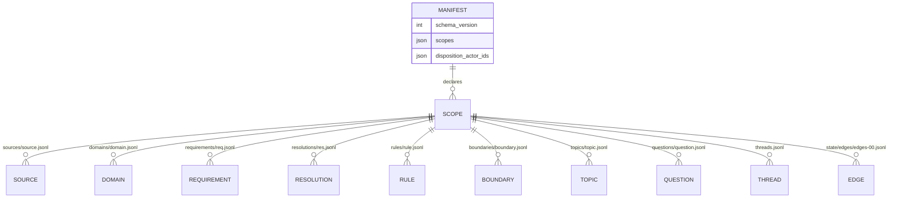
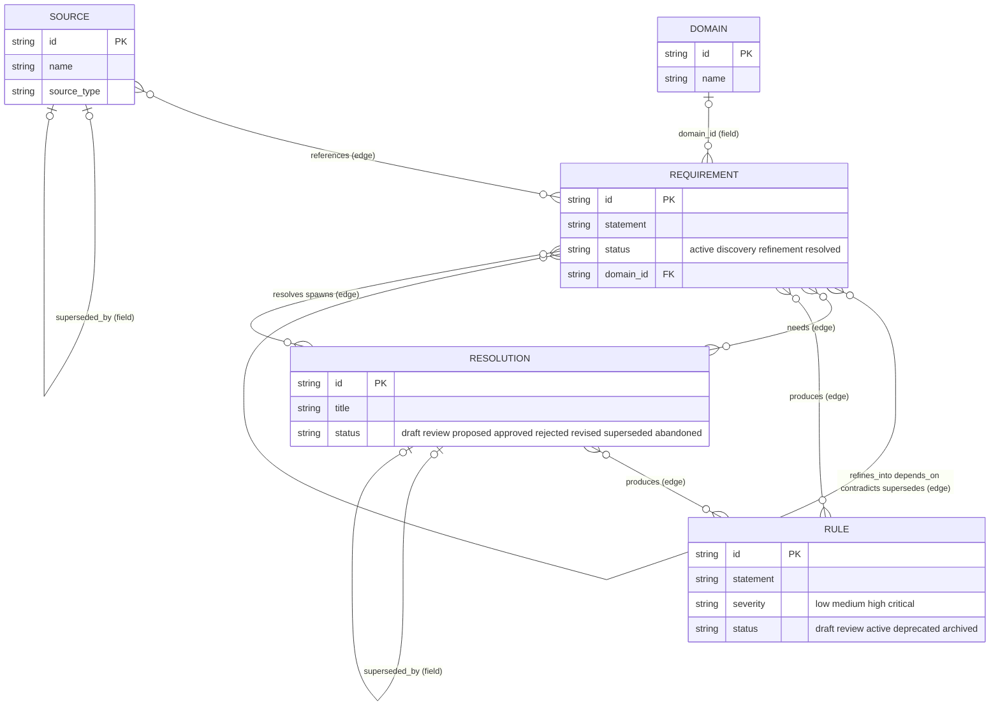
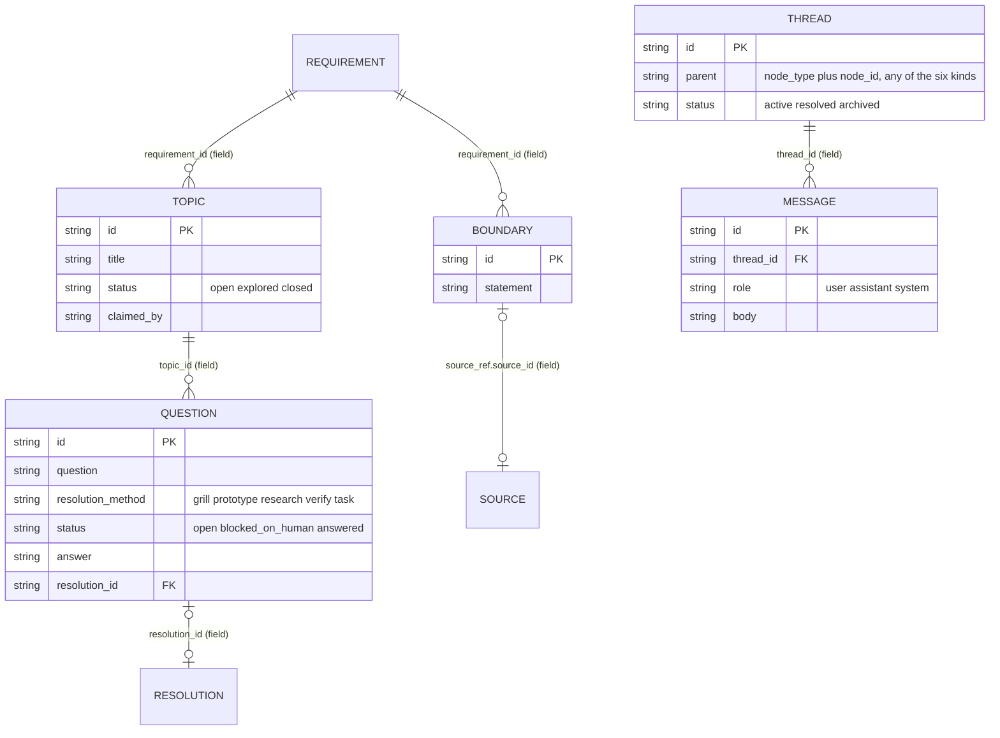
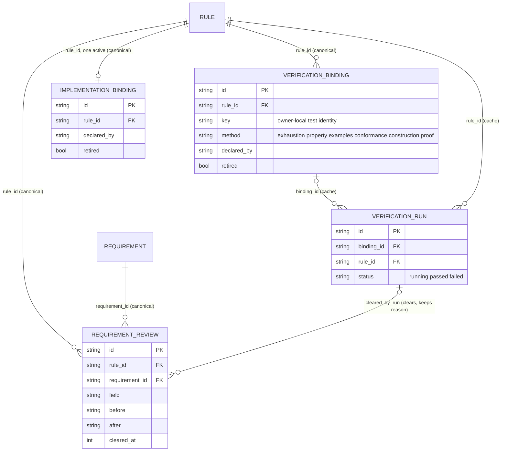
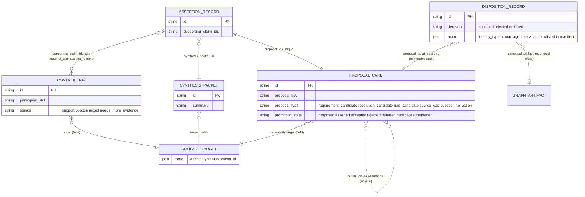

# Research: Provenance's Data — Structure Summary and ERD

**Date**: 2026-08-27T16:25:07+10:00
**Researcher**: Ben Nasraoui
**Git Commit**: 2e88c9b8173cb8ed4400fc2be5c192da002463cf
**Branch**: main
**Repository**: quality-sh/provenance

## Research Question

"Research and map out Provenance's Data. This should look like a summary of the current structure and an ERD."

## Summary

Provenance stores a requirements-traceability graph as newline-delimited JSON, and derives a SQLite query cache from it. Data lives in two trees:

1. **Canonical state** — `.provenance/state/`, committed to Git. A `manifest.json` lists scopes; each scope holds one JSONL shard per record family (sources, requirements, domains, boundaries, topics, questions, resolutions, rules, plus typed-SDK bindings, requirement reviews, threads, messages, and ideation lifecycle records). One repository-wide shard family holds all edges.
2. **Derived cache** — `.provenance/cache/`, Git-ignored. Holds `provenance.db` (SQLite, rebuildable with `provenance materialize`), advisory lock files, volatile verification-run logs, and import transaction staging.

The graph has six node kinds (`source`, `requirement`, `resolution`, `rule`, `topic`, `question`) joined by exactly nine typed edge kinds. The endpoint matrix is fixed in code: `references` runs Source→Requirement, four comparison types run Requirement→Requirement, `needs`/`resolves`/`spawns` join Requirements to Resolutions in defined directions, and `produces` is the only edge that may touch a Rule (as target only). Topic and Question never appear as edge endpoints; they attach to Requirements through their own foreign-key fields.

Around this canonical graph sit three auxiliary tiers: **typed SDK records** (verification bindings, implementation bindings, requirement reviews — each keyed by `rule_id`), **collaboration records** (threads and messages hanging off any node via a parent reference), and an **ideation lifecycle** pipeline (contributions → synthesis packets → proposals → assertions → dispositions) that links to graph artifacts through embedded `IdeationTarget` values rather than through edge rows.

The ERD below reflects schema version 1 after migrations 001–017. Services and service bindings were removed (migration 016/017); `rule_code`, `expression`, `inputs`, and `review_triggers` columns were dropped from the cache (015/016).

## Current Structure at a Glance

```
.provenance/
├── state/                              ← CANONICAL, git-tracked, JSONL, sorted by id
│   ├── manifest.json                   ← schema_version + scopes[] + disposition_actor_ids[]
│   ├── scopes/<scope>/
│   │   ├── sources/source.jsonl
│   │   ├── requirements/req.jsonl      ← requirements AND requirements/review.jsonl reviews
│   │   ├── requirements/review.jsonl   ← RequirementReview rows
│   │   ├── domains/domain.jsonl
│   │   ├── boundaries/boundary.jsonl
│   │   ├── topics/topic.jsonl
│   │   ├── questions/question.jsonl
│   │   ├── resolutions/res.jsonl
│   │   ├── rules/rule.jsonl
│   │   ├── verifications/binding.jsonl     ← VerificationBinding rows
│   │   ├── implementations/binding.jsonl   ← ImplementationBinding rows
│   │   ├── threads/threads.jsonl       ← Thread rows
│   │   ├── threads/YYYY-MM.jsonl       ← Message month shards
│   │   └── ideation/{contributions,synthesis_packets,
│   │                  proposal_cards,assertions,dispositions,
│   │                  landings}.jsonl  ← legacy promotion_decisions.jsonl read-only
│   └── edges/edges-00.jsonl            ← ALL edges, repo-wide single family
└── cache/                              ← DERIVED, gitignored
    ├── provenance.db                   ← SQLite materialization of state
    ├── locks/…                         ← fs2 advisory mirrors of every mutable shard
    ├── scopes/<scope>/verification-runs.jsonl  ← volatile VerificationRun evidence
    ├── import-publication.json         ← crash-recovery marker (when importing)
    └── import-transactions/            ← staging/backup dirs for import
```

Key facts:

- State is the source of truth; the DB is disposable ([docs/state-format.md](../../state-format.md), [docs/cache.md](../../cache.md)).
- Every record carries an envelope of `schema_version`, `scope_id`, `id`. There is no shared base struct; it is a repeated convention ([crates/provenance-core/src/model/](https://github.com/quality-sh/provenance/blob/2e88c9b8173cb8ed4400fc2be5c192da002463cf/crates/provenance-core/src/model/)).
- IDs are `[a-z0-9_-]+`, no enforced prefix. Only typed-SDK minting derives ids programmatically (hashes); everything else takes caller-chosen names.
- Optional fields are omitted when absent but preserved when present. `retired: true` retires Source/Requirement/Rule/bindings in place; history is never deleted.

## ERD

One diagram per data tier. Labels ending `(edge)` are stored as Edge rows in `edges/edges-00.jsonl`; labels ending `(field)` are plain fields on the child record.

### 1. Storage view — scopes and shard families



Every row above carries `schema_version`, `scope_id`, `id`. Requirement reviews (`requirements/review.jsonl`), verification and implementation bindings, messages, and all ideation records also live inside the scope directory; they appear in figures 3–5.

### 2. Requirement lineage — the six node kinds and their joins



Cardinality facts:

- The `Edge` relation is idempotent on its full tuple `(scope_id, edge_type, from_type, from_id, to_type, to_id)`; the row id derives from that tuple. No acyclicity check exists on edges; self-edges are not prohibited by type validation.
- Rules are leaves: no validation arm lets any edge leave a Rule; only `produces` may enter one ([edge_validation.rs:14-43](https://github.com/quality-sh/provenance/blob/2e88c9b8173cb8ed4400fc2be5c192da002463cf/crates/provenance-core/src/edge_validation.rs#L14-L43)).
- Cross-scope edges cannot exist: both endpoints must resolve inside the edge's own scope.
- Topic and Question are never edge endpoints; they join Requirements through fields (figure 3).

### Edge endpoint matrix

| EdgeType (`edge_type`) | From → To |
| --- | --- |
| `references` | source → requirement |
| `refines_into`, `depends_on`, `contradicts`, `supersedes` | requirement → requirement |
| `needs` | requirement → resolution |
| `resolves`, `spawns` | resolution → requirement |
| `produces` | resolution \| requirement → rule |

Source: [crates/provenance-core/src/edge_validation.rs](https://github.com/quality-sh/provenance/blob/2e88c9b8173cb8ed4400fc2be5c192da002463cf/crates/provenance-core/src/edge_validation.rs) (bound to Rule `rule_prov_edge_endpoint_table`). Live distribution in this repo today: produces 310, needs 95, resolves 93, references 71, refines_into 18, contradicts 1, spawns 1 out of 589 rows.

### 3. Shaping and discussion — boundaries, topics, questions, threads



Discussion attachments: Sources, Requirements, Resolutions, and Rules may each carry optional `origin_thread` / `origin_message` back-references pointing into this tier. Pinned graph-reference v1 exports strip them.

### 4. Code-level evidence — typed SDK bindings, reviews, runs



Verification bindings live in `verifications/binding.jsonl`; implementation bindings in `implementations/binding.jsonl`; reviews in `requirements/review.jsonl`; runs are volatile cache rows outside canonical state. Implementation binding is effectively 1:1 with a Rule while active (its id hashes only `rule_id`). Nothing here travels in pinned exports except the two binding families when non-empty.

### 5. Ideation lifecycle — proposals and their evidence chain



Pipeline reading order: Contribution → SynthesisPacket → ProposalCard (`proposed`) → AssertionRecord (`asserted`) → DispositionRecord (decided). Effective promotion state is derived at read time as disposition > assertion > claim. Batch envelope `IdeationLandingBatch` appends whole swarm batches atomically to `ideation/landings.jsonl`; readers overlay them onto direct shards keyed by id. `GRAPH_ARTIFACT` narrows to source / requirement / resolution / rule via scope lookup; `ARTIFACT_TARGET` additionally admits topic / question / domain. None of this tier travels in pinned graphs or uses edge rows.

## Detailed Findings

### Manifest and scopes

[Manifest struct](https://github.com/quality-sh/provenance/blob/2e88c9b8173cb8ed4400fc2be5c192da002463cf/crates/provenance-core/src/model/manifest.rs): `schema_version`, `scopes: Vec<Scope>{id, path_prefix}`, optional `disposition_actor_ids: Vec<String>` (the allowlist that gates who may file dispositions). Shard paths derive from scope ids.

All records share the envelope `schema_version: 1`, `scope_id`, `id`; outputs are snake_case, camelCase aliases are accepted on input only ([model docs research](https://github.com/quality-sh/provenance/blob/2e88c9b8173cb8ed4400fc2be5c192da002463cf/crates/provenance-core/src/model/artifacts.rs)).

### Canonical graph nodes

Field tables below show JSON names; `?` marks optional.

**Source** ([artifacts.rs:223](https://github.com/quality-sh/provenance/blob/2e88c9b8173cb8ed4400fc2be5c192da002463cf/crates/provenance-core/src/model/artifacts.rs#L223-L273)):
`name`, `source_type` ∈ enum, `url?`, `reference?`, `commit_pin?` (7–64 hex), `effective_date?`, `review_date?`, `superseded_by?` (→ another Source id), `origin_thread?`, `origin_message?`, plus integration trio `declared_by?`, `declaration_address?`, `retired` (omitted when false).

**Requirement** ([artifacts.rs:283](https://github.com/quality-sh/provenance/blob/2e88c9b8173cb8ed4400fc2be5c192da002463cf/crates/provenance-core/src/model/artifacts.rs#L283-L318)):
`statement`, `status` ∈ {active, discovery, refinement, resolved}, `description?`, `fog?` (free text), `domain_id?` (the only domain-grouping pointer), `source_refs?: [{source_id, clause?}]` (mirror of References edges), `origin_thread?/origin_message?`, integration trio.

**Resolution** ([artifacts.rs:354](https://github.com/quality-sh/provenance/blob/2e88c9b8173cb8ed4400fc2be5c192da002463cf/crates/provenance-core/src/model/artifacts.rs#L354-L401)):
`title`, `position`, `rationale`, `status` ∈ {draft, review, proposed, approved, rejected, revised, superseded, abandoned}, `context?`, `enforcement?`, `confidence?` (0.0–1.0 finite), `inputs: [{input_type, reference, summary}]`, `made_by?`, `approved_by?`, `approved_at?`, `superseded_by?` (→ Resolution), `review_on?` (date string, key required when present), `origin_thread?/origin_message?`.

**Rule** ([artifacts.rs:403](https://github.com/quality-sh/provenance/blob/2e88c9b8173cb8ed4400fc2be5c192da002463cf/crates/provenance-core/src/model/artifacts.rs#L403-L445)):
`statement`, `status` ∈ {draft, review, active, deprecated, archived}, `severity` ∈ {low, medium, high, critical}, `name?`, `description?`, `source_document?`, `source_section?` (citations — these do NOT count as implementation), `origin_thread?/origin_message?`, integration trio.

**Domain** ([services.rs:5](https://github.com/quality-sh/provenance/blob/2e88c9b8173cb8ed4400fc2be5c192da002463cf/crates/provenance-core/src/model/services.rs#L5-L15)): `name`, `description?`, `color?`.

**Boundary** ([shaping.rs:112](https://github.com/quality-sh/provenance/blob/2e88c9b8173cb8ed4400fc2be5c192da002463cf/crates/provenance-core/src/model/shaping.rs#L112-L122)): `requirement_id` (FK), `statement`, `source_ref?: {source_id, clause?}`.

**Topic** ([shaping.rs:124](https://github.com/quality-sh/provenance/blob/2e88c9b8173cb8ed4400fc2be5c192da002463cf/crates/provenance-core/src/model/shaping.rs#L124-L139)): `requirement_id` (FK), `title`, `status` ∈ {open, explored, closed}, `claimed_by?`, `claimed_at?`, `links: [{target_type, target_id}]`.

**Question** ([shaping.rs:141](https://github.com/quality-sh/provenance/blob/2e88c9b8173cb8ed4400fc2be5c192da002463cf/crates/provenance-core/src/model/shaping.rs#L141-L169)): all Topic base fields plus `topic_id` (FK), `question`, `resolution_method` ∈ {grill, prototype, research, verify, task}, `status` ∈ {open, blocked_on_human, answered}, `answer?`, `resolution_id?` (FK, closes the loop to a Resolution). Writes validate parents exist and copy the parent topic's `requirement_id`.

The read-side union over six node kinds is tagged `node_type` in [protocol/node.rs](https://github.com/quality-sh/provenance/blob/2e88c9b8173cb8ed4400fc2be5c192da002463cf/crates/provenance-core/src/protocol/node.rs). Retirement applies only to Source, Requirement, Rule (+bindings); the rest manage lifecycle through status words.

### Typed SDK relationship records ([integrations.rs](https://github.com/quality-sh/provenance/blob/2e88c9b8173cb8ed4400fc2be5c192da002463cf/crates/provenance-core/src/model/integrations.rs))

- **VerificationBinding** (canonical, `verifications/binding.jsonl`): `rule_id`, `key` (owner-local test identity), `method` ∈ {exhaustion, property, examples, conformance, construction, proof}, `declared_by`, `file`, `symbol?`, `retired`. Id = `verification_binding_<sha256(declared_by␀rule_id␀key)[..20]>`.
- **ImplementationBinding** (canonical, `implementations/binding.jsonl`): `rule_id`, `declared_by`, `file`, `symbol` (required), `retired`. Id = `implementation_binding_<sha256(rule_id)[..20]>` — one active binding per rule.
- **RequirementReview** (canonical, `requirements/review.jsonl`): `rule_id`, `requirement_id`, `field`, `before`, `after`, `changed_at`, `cleared_at?`, `cleared_by_run?`. Id hashes `(rule_id, requirement_id, field, after)` so re-applying the same restatement never reopens a review. Rows keep their reason forever.
- **VerificationRun** (volatile, `.provenance/cache/scopes/<scope>/verification-runs.jsonl`): `binding_id?`, `rule_id`, `method`, `declared_by`, `file?`, `symbol?`, `commit?`, `status` ∈ {running, passed, failed}, `started_at`, `completed_at?`, `error?`. Runs clear open reviews for that Rule on start; runs never enter canonical exports.

A Rule with no live implementation binding is simply unimplemented — there is no boolean anywhere; absence is derived.

### Collaboration records ([collaboration.rs](https://github.com/quality-sh/provenance/blob/2e88c9b8173cb8ed4400fc2be5c192da002463cf/crates/provenance-core/src/model/collaboration.rs))

- **Thread**: `parent: {node_type, node_id}` targeting any of the six node kinds, `status` ∈ {active, resolved, archived}, `created_at` (logical sequence starting at 1). Posting reconciles to one canonical active thread per parent and archives siblings.
- **Message**: `thread_id` (FK), `role` ∈ {user, assistant, system}, `body` (input alias `content`), `created_at` (monotonic per store), `ai_metadata?` (arbitrary JSON). Stored in month shards `threads/YYYY-MM.jsonl`.

Back-links are soft: Sources, Requirements, Resolutions, Rules may carry `origin_thread`/`origin_message`. Both directions are stripped/refused in pinned graph-reference v1 exports.

### Ideation lifecycle records ([ideation models](https://github.com/quality-sh/provenance/tree/2e88c9b8173cb8ed4400fc2be5c192da002463cf/crates/provenance-core/src/model/ideation))

Pipeline: Contribution → SynthesisPacket → ProposalCard (`proposed`) → AssertionRecord (`asserted`) → DispositionRecord (decided).

- **Contribution** (`ideation/contributions.jsonl`): embedded `target {artifact_type, artifact_id}` naming any of source/requirement/resolution/rule/topic/question/domain; `participant_slot`, `stance` ∈ {support, oppose, mixed, needs_more_evidence}, `strongest_finding`, `evidence_references[]`, `material_claims[]` (claims carry optional confidence), risks/objections/challenges/suggested_artifact_changes/unsupported_recommendations/open_questions, `uncertainty {level, rationale}`.
- **SynthesisPacket** (`ideation/synthesis_packets.jsonl`): shares the proposal's target; holds consensus findings, contested claims, minority objections, evidence gaps, unsupported speculation, open questions, `suggested_artifacts[]` (which name `proposal_id`s), and `required_human_decisions[]` with `blocks_promotion` flags.
- **ProposalCard** (`ideation/proposal_cards.jsonl`): `proposal_key`, `proposal_type` ∈ {requirement_candidate, resolution_candidate, rule_candidate, source_gap, question, no_action}, `title`, `summary`, `confidence?`, `traceability {target, source_ids, evidence_references, supporting_claim_ids}`, claimed `promotion_state`, `builds_on` (assertion ids of other proposals; lineage must be acyclic), `duplicate_of?`, `superseded_by?`. Effective promotion state is derived at read time as disposition > assertion > claim.
- **AssertionRecord** (`ideation/assertions.jsonl`): `proposal_id` (UNIQUE per scope), `synthesis_packet_id`, `supporting_claim_ids`. Heavy write gates: packet must qualify the proposal; claim sets must match traceability exactly; each cited claim resolves into exactly one contribution.
- **DispositionRecord** (`ideation/dispositions.jsonl`; frozen legacy path `promotion_decisions.jsonl` read-only): `proposal_id`, `decision` ∈ {accepted, rejected, deferred}, `rationale`, `actor {identity_type ∈ {human, agent, service}, id, name?}`, optional `canonical_artifact {artifact_type, artifact_id}` (must resolve to an existing canonical record), optional `external_action {system, scope, kind, key}` identity tuple. Acceptance of a live proposal normally requires a prior assertion unless a human actor ratifies via `canonical_artifact`. Actor must be allowlisted in the manifest.

Batch envelope `IdeationLandingBatch` appends whole swarm batches atomically to `ideation/landings.jsonl`; readers overlay them onto direct shards keyed by id.

None of the ideation tier travels in pinned graphs or joins the graph through edges — connections are embedded targets and hashed claim ids.

### Physical layout and locking

Path builders live in [layout.rs](https://github.com/quality-sh/provenance/blob/2e88c9b8173cb8ed4400fc2be5c192da002463cf/crates/provenance-store/src/layout.rs) and [shards.rs](https://github.com/quality-sh/provenance/blob/2e88c9b8173cb8ed4400fc2be5c192da002463cf/crates/provenance-store/src/shards.rs). Lock ordering is mandatory: repository publication lock → scope lifecycle lock → shard lock ([docs/state-format.md](../../state-format.md)). Every mutable shard gets a mirror `.lock` under `cache/locks/`. Import stages into `cache/import-transactions/<dir>/backup-state`, publishes by rename, and recovers interrupted publications before any read.

### SQLite cache schema (migrations 001–017)

DB: `.provenance/cache/provenance.db`. Tables confirmed in the live database:

| Table | Columns after all migrations | PK |
| --- | --- | --- |
| `_schema_migrations` | id, applied_at | id |
| `manifest_scopes` | scope_id, path_prefix | (scope_id) — vestigial, unused |
| `sources` | scope_id, id, name, source_type, url?, reference?, effective_date?, review_date?, superseded_by?, commit_pin? | (scope_id, id) |
| `requirements` | scope_id, id, statement, status, domain_id?, fog? | (scope_id, id) |
| `domains` | scope_id, id, name, description?, color? | (scope_id, id) |
| `boundaries` | scope_id, id, requirement_id, statement, source_id?, source_clause? | (scope_id, id) |
| `topics` | scope_id, id, requirement_id, title, status, claimed_by?, claimed_at?, links(JSON) | (scope_id, id) |
| `questions` | scope_id, id, topic_id, requirement_id, question, status, answer?, links(JSON), resolution_id?, resolution_method, claimed_by?, claimed_at? | (scope_id, id) |
| `resolutions` | scope_id, id, title, position, rationale, status, review_on?, context?, enforcement?, confidence?, inputs(JSON), made_by?, approved_by?, approved_at?, superseded_by? | (scope_id, id) |
| `rules` | scope_id, id, statement, status, severity (narrowed by drops 015/016) | (scope_id, id) |
| `edges` | scope_id, id, edge_type, from_type, from_id, to_type, to_id | (scope_id, id) |
| `threads` | scope_id, id, parent_type, parent_id, status, created_at | (scope_id, id) |
| `messages` | scope_id, id, thread_id, role, body, created_at, ai_metadata? | (scope_id, id) |
| `contributions` | scope_id, id, target_type, target_id, participant_slot, stance, strongest_finding, uncertainty, payload(full JSON) | (scope_id, id) |
| `synthesis_packets` | scope_id, id, target_type, target_id, summary, payload | (scope_id, id) |
| `proposal_cards` | scope_id, id, proposal_key, proposal_type, title, summary, target_type, target_id, traceability(JSON), promotion_state, duplicate_of?, superseded_by?, confidence?, builds_on(JSON) | (scope_id, id) |
| `assertion_records` | scope_id, id, proposal_id, synthesis_packet_id, supporting_claim_ids(JSON), payload | (scope_id, id) |
| `dispositions` | scope_id, id, proposal_id, decision, rationale, actor, canonical_artifact?, external_action? | (scope_id, id) |

Not materialized: verification bindings, implementation bindings, requirement reviews, and verification runs stay JSONL-only; report modules read them straight from the store ([cache/health.rs](https://github.com/quality-sh/provenance/blob/2e88c9b8173cb8ed4400fc2be5c192da002463cf/crates/provenance-store/src/cache/health.rs)).

Shard → table during [materialize](https://github.com/quality-sh/provenance/blob/2e88c9b8173cb8ed4400fc2be5c192da002463cf/crates/provenance-store/src/cache/materialize.rs): copy state under the publication lock → run aggregate validation → migrate → delete all sixteen tables → load graph families then collaboration families then edges once, in one transaction. `promotion_state` inserted into `proposal_cards` is recomputed via `effective_proposal_state(proposal, assertions, dispositions)`.

Removed by migration (historical context): services/service_bindings tables (009 added, 016 dropped, 017 deletes their shards), `rules.rule_code/expression/inputs` and `resolutions.review_triggers` columns (015/016).

## Code References

- `crates/provenance-core/src/model/graph.rs:77-110` — Edge struct, EdgeType variants, deterministic edge id
- `crates/provenance-core/src/edge_validation.rs:14-43` — endpoint matrix (Rule `rule_prov_edge_endpoint_table`)
- `crates/provenance-core/src/model/artifacts.rs` — Source, SourceReference, Requirement, ResolutionInput, Resolution, Rule
- `crates/provenance-core/src/model/shaping.rs:104-169` — ArtifactLink, Boundary, Topic, Question
- `crates/provenance-core/src/model/services.rs:5-15` — Domain
- `crates/provenance-core/src/model/collaboration.rs:37-65` — ThreadParent, Thread, Message
- `crates/provenance-core/src/model/integrations.rs:106-182` — VerificationRun, VerificationBinding, RequirementReview, ImplementationBinding
- `crates/provenance-core/src/model/ideation/*` — Contribution, SynthesisPacket, ProposalCard, AssertionRecord, DispositionRecord, enums
- `crates/provenance-core/src/model/ids.rs:18-96` — StableId/ScopeId charset enforcement
- `crates/provenance-store/src/layout.rs:12-77` — every filesystem path
- `crates/provenance-store/src/shards.rs:6-151` — shard-per-family mapping
- `crates/provenance-store/src/migrations.rs` + SQL files — SQLite DDL 001–017
- `crates/provenance-store/src/cache/materialize.rs:19-43` — snapshot/clear/load cycle
- `crates/provenance-store/src/publication.rs:132-208` — import marker, phases, recovery
- `.provenance/state/manifest.json` — live example: one scope `default`, actor allowlist
- `.provenance/state/edges/edges-00.jsonl` — 589 live edge rows

## Architecture Insights

1. **Files are truth; SQLite is disposable.** Canonical JSONL sorts deterministically by id so diffs stay small and mergeable; the DB exists purely for query ergonomics and is rebuilt transactionally.
2. **Two connection systems, deliberately split.** Structural facts between artifact kinds use validated Edge rows; behavioral/lifecycle attachments (domains, shaping parents, threads, ideation targets, bindings) use plain fields on child records. This keeps the edge matrix tiny and auditable.
3. **Derived, never stored, negations.** No `verified`/`implemented` booleans exist; unimplemented/unverified states come from missing live bindings. Reviews keep reasons and clear in place.
4. **Immutability where audit matters.** Proposals are written once as `proposed`; dispositions append-only; terminal legacy rows fingerprint-frozen. Retirement (`retired: true`) preserves ids and history instead of deleting.
5. **Hash-derived identities only where ownership matters.** Bindings, reviews, edge ids derive from semantic tuples, making duplicates converge to one row without coordination.
6. **Cooperative durability.** Mandatory lock order (repository → lifecycle → shard), temp-file persist, directory fsync, staged import with recovery — crash-safety without a database server.

## Historical Context

- `docs/state-format.md` — canonical store contract, retirement/adoption semantics, ideation paths, lock order, graph-reference v1 projection exclusions
- `docs/cache.md` — cache disposal contract and migration policy
- Migration trail: services existed until migration 016/017 removed them; `rule_code`, `expression`, `inputs`, `review_triggers` were runtime leftovers dropped in 015/016; `promotion_decisions` renamed to `dispositions` in 013 with external_action added in 014
- [docs/research/2026-08-27-programmable-graph-change-proposals.md](./2026-08-27-programmable-graph-change-proposals.md) — active exploration that may reshape how changes enter this graph
- `docs/typescript-sdk-poc.md` — typed declaration surface writing the binding/review records described above

## Related Research

- [docs/research/2026-08-27-sdk-authoring-surface-and-codemode-agents.md](./2026-08-27-sdk-authoring-surface-and-codemode-agents.md)
- [docs/research/2026-08-27-programmable-graph-change-proposals.md](./2026-08-27-programmable-graph-change-proposals.md)
- [docs/research/2026-08-15-simple-technical-english-configuration.md](./2026-08-15-simple-technical-english-configuration.md)

## Open Questions

- Message month shards: the writer still targets the constant `threads/2026-07.jsonl`; rolling shards forward appears unfinished in the writer path.
- `depends_on` and `supersedes` edge types are first-class but currently unused in the live graph (0 rows).
- Edge id derivation uses Rust `Debug` formatting; historical rows spell multi-word types separated (`refines_into_...`) while Debug would emit `refinesinto` — stored ids are trusted verbatim, never recomputed, so the divergence is inert but worth knowing when predicting ids.
- `manifest_scopes` survives in SQLite but nothing reads or writes it; likely removable in a future migration.
